### 前言

本篇文章介绍如何白嫖谷歌翻译服务翻译浏览器网页，以及如何从压缩混淆后一万多行代码中探索 bug 的真相。压缩混淆后的源码调试面临以下挑战：

- 1.由于变量名或者函数名经过压缩，因此如果想要在文件中查找函数名称或者变量名称尤其困难
- 2.追踪对象属性在哪里被修改变得更加困难

因此本文将介绍

- 如何使用构造函数缩小变量的查询范围
- 如何使用 object.defineProperty 追踪属性的修改

### 业务背景

在我们的业务场景中，有些文案是商家自己输入的，此时我们无法针对这些输入做多语言的转换，因此只能另辟蹊径，借助谷歌翻译服务。具体接入方式如下：

```js
<!DOCTYPE html>
<html lang="en">
  <head>
    <meta charset="utf-8" />
    <title>谷歌翻译服务Demo</title>
    <meta name="referrer" content="no-referrer" />
    <meta name="viewport" content="width=device-width, initial-scale=1" />
    <style></style>
  </head>

  <body>
    <div id="root">
      <div id="繁体">庫存</div>
      <div id="简体">库存</div>
      <div id="英语">in stock</div>
      <div id="日本语">在庫あり</div>
      <div id="韩语">재고</div>
      <div id="google_translate_element"></div>
    </div>
    <script>
      function googleTranslateElementInit() {
        // pageLanguage指定页面语言，如果指定为 auto，则告诉谷歌自动检测文字语言类型
          new google.translate.TranslateElement({ pageLanguage: 'auto' }, "google_translate_element");
      }
      (function () {
        var gtConstEvalStartTime = new Date();
        var h = this || self,
          l = /^[\w+/_-]+[=]{0,2}$/,
          m = null;
        function n(a) {
          return (a = a.querySelector && a.querySelector("script[nonce]")) &&
            (a = a.nonce || a.getAttribute("nonce")) &&
            l.test(a)
            ? a
            : "";
        }
        function p(a, b) {
          function c() {}
          c.prototype = b.prototype;
          a.i = b.prototype;
          a.prototype = new c();
          a.prototype.constructor = a;
          a.h = function (g, f, k) {
            for (
              var e = Array(arguments.length - 2), d = 2;
              d < arguments.length;
              d++
            )
              e[d - 2] = arguments[d];
            return b.prototype[f].apply(g, e);
          };
        }
        function q(a) {
          return a;
        }
        function r(a) {
          if (Error.captureStackTrace) Error.captureStackTrace(this, r);
          else {
            var b = Error().stack;
            b && (this.stack = b);
          }
          a && (this.message = String(a));
        }
        p(r, Error);
        r.prototype.name = "CustomError";
        function u(a, b) {
          a = a.split("%s");
          for (var c = "", g = a.length - 1, f = 0; f < g; f++)
            c += a[f] + (f < b.length ? b[f] : "%s");
          r.call(this, c + a[g]);
        }
        p(u, r);
        u.prototype.name = "AssertionError";
        function v(a, b) {
          throw new u(
            "Failure" + (a ? ": " + a : ""),
            Array.prototype.slice.call(arguments, 1)
          );
        }
        var w;
        function x(a, b) {
          this.g = b === y ? a : "";
        }
        x.prototype.toString = function () {
          return this.g + "";
        };
        var y = {};
        function z(a) {
          var b = document.getElementsByTagName("head")[0];
          b ||
            (b = document.body.parentNode.appendChild(
              document.createElement("head")
            ));
          b.appendChild(a);
        }
        function _loadJs(a) {
          var b = document;
          var c = "SCRIPT";
          "application/xhtml+xml" === b.contentType && (c = c.toLowerCase());
          c = b.createElement(c);
          c.type = "text/javascript";
          c.charset = "UTF-8";
          if (void 0 === w) {
            b = null;
            var g = h.trustedTypes;
            if (g && g.createPolicy) {
              try {
                b = g.createPolicy("goog#html", {
                  createHTML: q,
                  createScript: q,
                  createScriptURL: q,
                });
              } catch (t) {
                h.console && h.console.error(t.message);
              }
              w = b;
            } else w = b;
          }
          a = (b = w) ? b.createScriptURL(a) : a;
          a = new x(a, y);
          a: {
            try {
              var f = c && c.ownerDocument,
                k = f && (f.defaultView || f.parentWindow);
              k = k || h;
              if (k.Element && k.Location) {
                var e = k;
                break a;
              }
            } catch (t) {}
            e = null;
          }
          if (
            e &&
            "undefined" != typeof e.HTMLScriptElement &&
            (!c ||
              (!(c instanceof e.HTMLScriptElement) &&
                (c instanceof e.Location || c instanceof e.Element)))
          ) {
            e = typeof c;
            if (("object" == e && null != c) || "function" == e)
              try {
                var d =
                  c.constructor.displayName ||
                  c.constructor.name ||
                  Object.prototype.toString.call(c);
              } catch (t) {
                d = "<object could not be stringified>";
              }
            else
              d = void 0 === c ? "undefined" : null === c ? "null" : typeof c;
            v(
              "Argument is not a %s (or a non-Element, non-Location mock); got: %s",
              "HTMLScriptElement",
              d
            );
          }
          a instanceof x && a.constructor === x
            ? (d = a.g)
            : ((d = typeof a),
              v(
                "expected object of type TrustedResourceUrl, got '" +
                  a +
                  "' of type " +
                  ("object" != d
                    ? d
                    : a
                    ? Array.isArray(a)
                      ? "array"
                      : d
                    : "null")
              ),
              (d = "type_error:TrustedResourceUrl"));
          c.src = d;
          (d = c.ownerDocument && c.ownerDocument.defaultView) && d != h
            ? (d = n(d.document))
            : (null === m && (m = n(h.document)), (d = m));
          d && c.setAttribute("nonce", d);
          z(c);
        }
        function _loadCss(a) {
          var b = document.createElement("link");
          b.type = "text/css";
          b.rel = "stylesheet";
          b.charset = "UTF-8";
          b.href = a;
          z(b);
        }
        function _isNS(a) {
          a = a.split(".");
          for (var b = window, c = 0; c < a.length; ++c)
            if (!(b = b[a[c]])) return !1;
          return !0;
        }
        function _setupNS(a) {
          a = a.split(".");
          for (var b = window, c = 0; c < a.length; ++c)
            b.hasOwnProperty
              ? b.hasOwnProperty(a[c])
                ? (b = b[a[c]])
                : (b = b[a[c]] = {})
              : (b = b[a[c]] || (b[a[c]] = {}));
          return b;
        }
        window.addEventListener &&
          "undefined" == typeof document.readyState &&
          window.addEventListener(
            "DOMContentLoaded",
            function () {
              document.readyState = "complete";
            },
            !1
          );
        if (_isNS("google.translate.Element")) {
          return;
        }
        (function () {
          var c = _setupNS("google.translate._const");
          c._cest = gtConstEvalStartTime;
          gtConstEvalStartTime = undefined;
          c._cl = "en";
          c._cuc = "googleTranslateElementInit";
          c._cac = "";
          c._cam = "";
          c._ctkk = "448204.2198466445";
          var h = "translate.googleapis.com";
          var s =
            (true
              ? "https"
              : window.location.protocol == "https:"
              ? "https"
              : "http") + "://";
          var b = s + h;
          c._pah = h;
          c._pas = s;
          c._pbi = b + "/translate_static/img/te_bk.gif";
          c._pci = b + "/translate_static/img/te_ctrl3.gif";
          c._pli = b + "/translate_static/img/loading.gif";
          c._plla = h + "/translate_a/l";
          c._pmi = b + "/translate_static/img/mini_google.png";
          c._ps = b + "/translate_static/css/translateelement.css";
          c._puh = "translate.google.com";
          _loadCss(c._ps);
          _loadJs(b + "/translate_static/js/element/main_zh-CN.js");
        })();
      })();
    </script>
  </body>
</html>
```

今天接到一个 bug，如果后端返回的页面中，文案是繁体字时，此时切换语言选择器，切换成简体中文，发现这部分文案没有被翻译

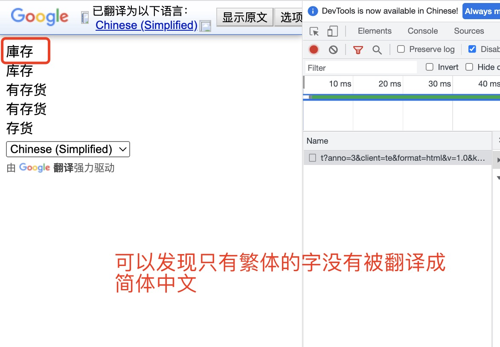

可以发现，当切换语言为简体中文时，只有繁体的字没有被翻译，其余的都被翻译成简体中文了。

### 如何从一万多行的压缩混淆的源码中探索真相

#### 1. 首先在 DOM 上打个断点

谷歌在翻译我们的网页时，会自动在文本节点上插入 `font` 节点


借助这一点，我们可以在有问题的 dom 上打个断点，看看谷歌是如何更新我们的 dom 节点的


然后切换语言，这里可以选择英语

谷歌在翻译时，会先移除节点再插入新的节点，因此这里我们可以直接跳过


一直跳过，直到函数执行到 `cu` 调用栈，此时观察浏览器页面会发现新的翻译节点 `in stock` 已经插入进来

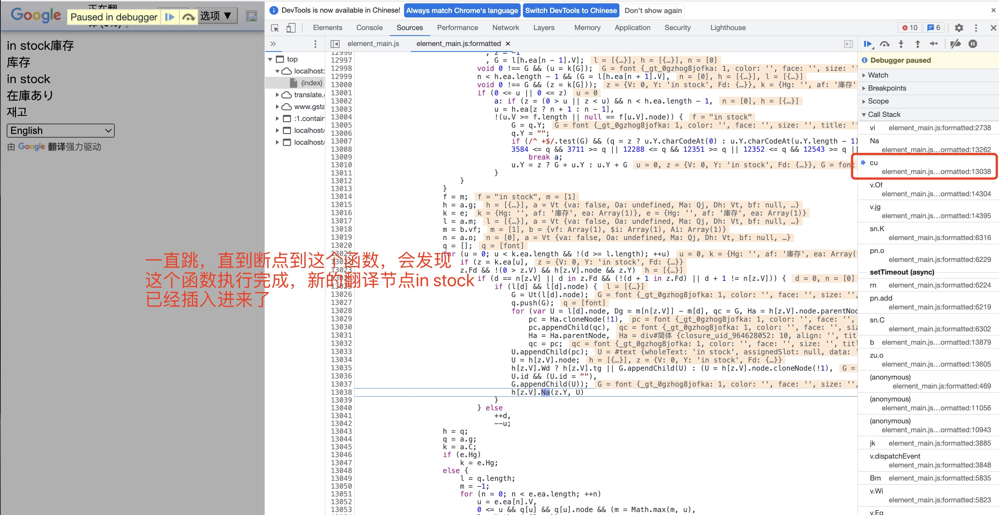

因此有理由相信这个 `cu` 函数就是插入节点的函数。在这个函数入口处打个断点：

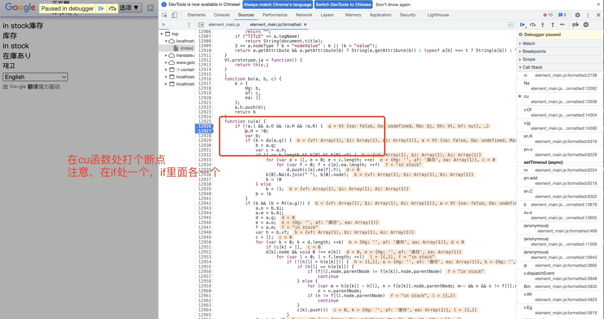

此时将选择器切换成简体中文，会发现由于 `a.K` 为 `true` 导致 `if` 语句块没有执行，节点没有被翻译：

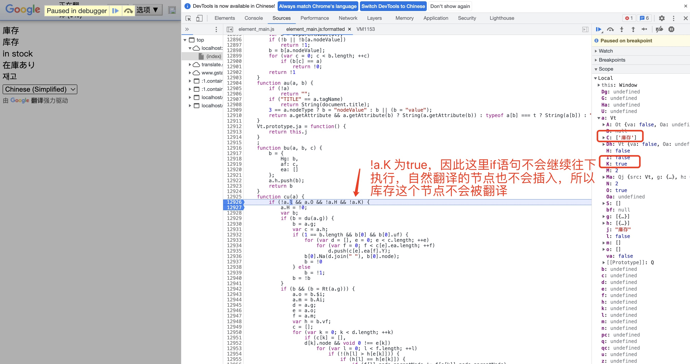

那为什么 庫存 节点的 `a.K` 为 `true`，其他节点的就是 `false` 呢？

顺着调用栈往上找：


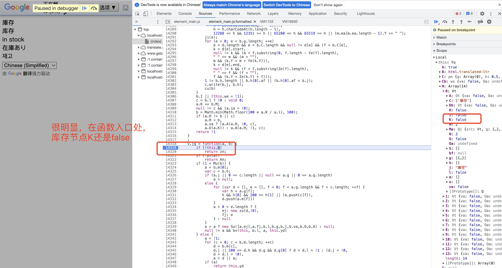

很明显，当断点执行到 `v.jg` 时，库存节点的 `K` 还是 `false`，为啥函数执行完成，`K` 就变成了 `true`？这个方法肯定是做了某些操作。排查范围已经缩小到这个函数了。因此我们只需要一步步执行，最终执行到这里的时候发现：

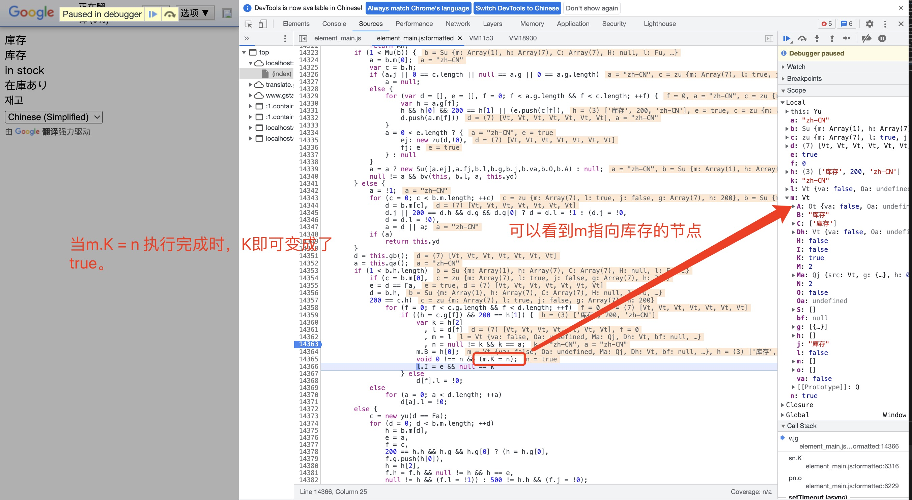


由此可以得出初步结论，当我们切换的语言为简体中文，即 "zh-CN" 时，并且和 `h[2]` 所设置的语言一致时，此时会将 K 设置为 true，并跳过我们的翻译。因此只需要排查 `h` 是个什么东西。


那 `h[2]` 又是什么呢？？


既然 `c` 是一个 `zu` 类型的对象，那它一定是通过构造函数 `new zu` 构造出来的，因此我们全局搜索 `new zu` 并在这些语句的地方打个断点

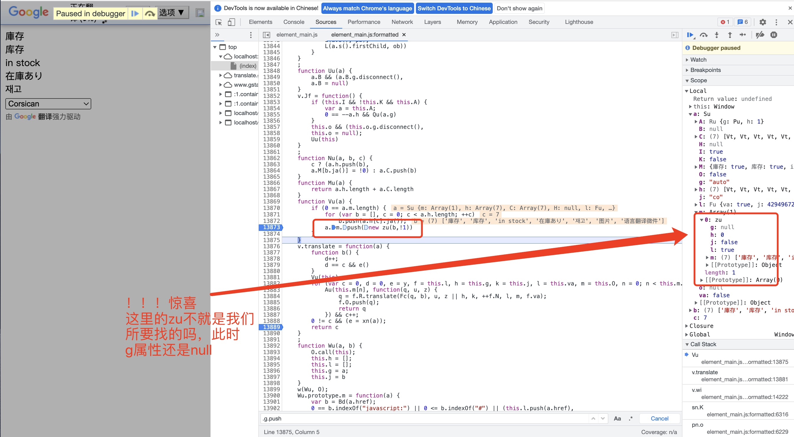

回到控制台，添加几行代码：

```js
Object.defineProperty(a.m[0], "g", {
  set: function (newVal) {
    debugger;
    console.log("newVal====", newVal);
  },
});
```

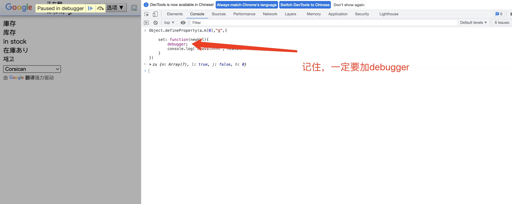

继续执行代码：

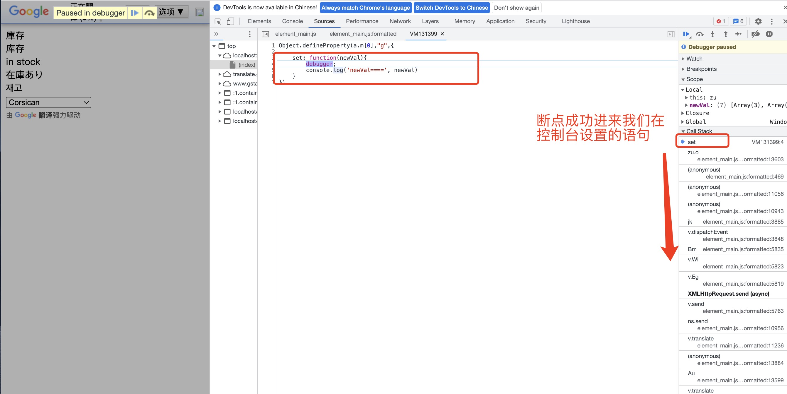

沿着 `set` 的调用栈往上找：

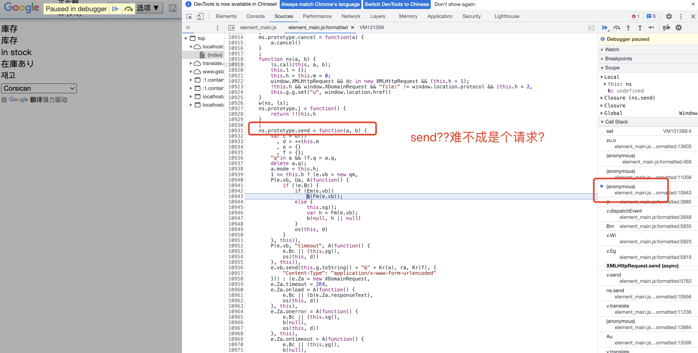

于是在 `send` 函数的入口打一个断点

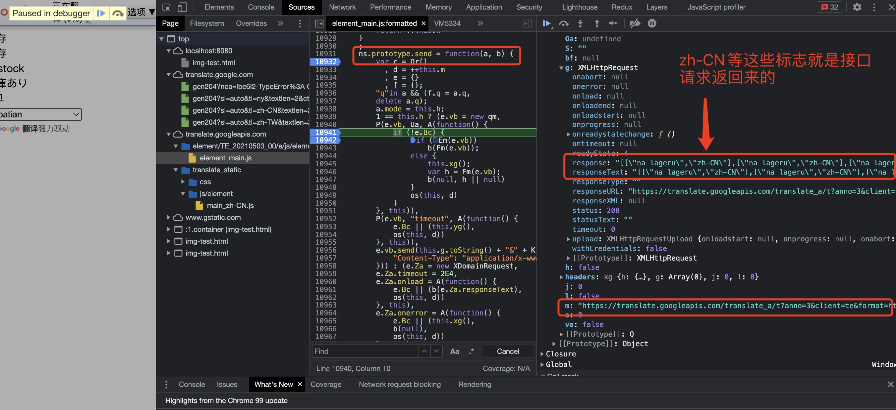

可以知道 `zh-CN` 就是接口返回来的，因此我们去控制台查看网络请求：


原来这是谷歌翻译接口返回来的标志，那这些标志代表什么？

回到我们的 demo 中

```html
<div id="繁体">庫存</div>
<div id="简体">库存</div>
<div id="英语">in stock</div>
<div id="日本语">在庫あり</div>
<div id="韩语">재고</div>
```

当我们初始化谷歌翻译实例时

```js
new google.translate.TranslateElement(
  { pageLanguage: "en" },
  "google_translate_element"
);
```

如果指定的 `pageLanguage` 为 特定语言，比如 `en`，那么告诉谷歌只帮忙翻译页面中的英文单词，其余语言不用翻译。此时谷歌翻译接口返回的数据中不会带有语言标志，比如 `zh-CN`

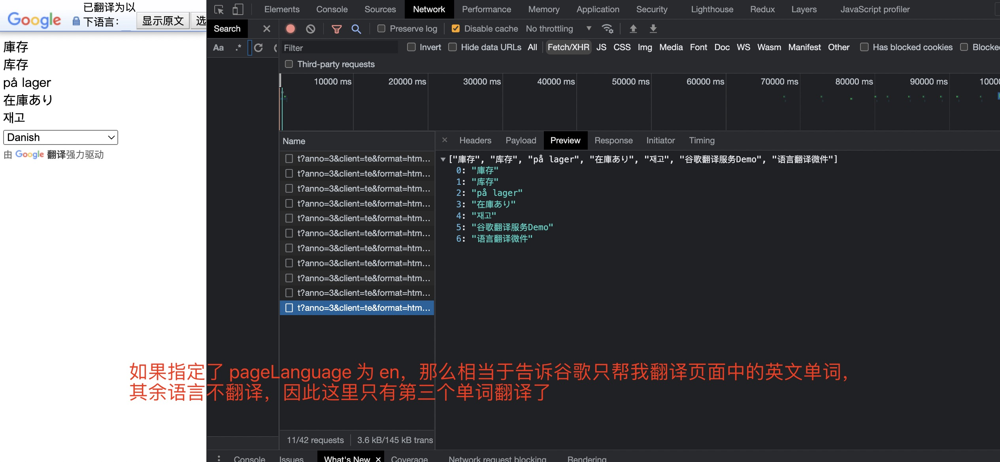

如果指定的 `pageLanguage` 为 `auto`，那么相当于告诉谷歌自定检测页面所有字的语言类型，并翻译成我选择的语言

```js
new google.translate.TranslateElement(
  { pageLanguage: "auto" },
  "google_translate_element"
);
```

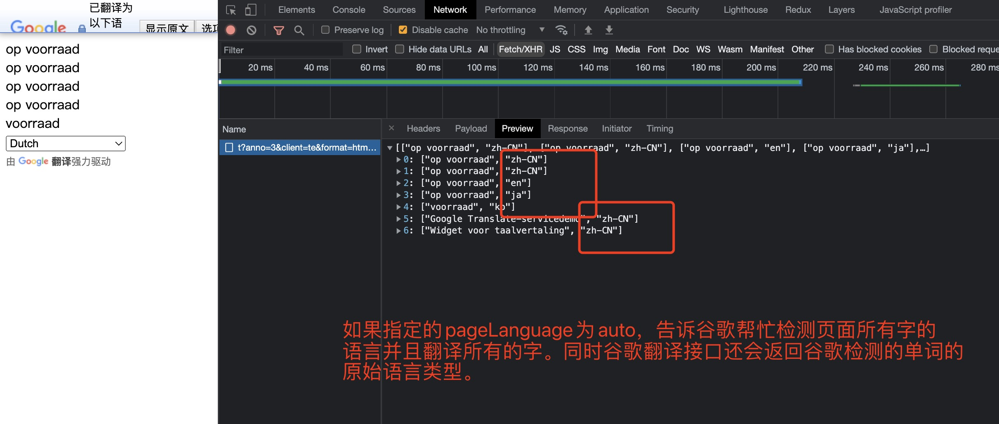

可以看到谷歌翻译接口返回了谷歌检测的原始语言类型。注意，这里 `庫存` 这个繁体单词，谷歌检测到的是 `zh-CN`，而不是 `zh-TW`！！！其余单词的检测均是正常的

### 结论

- 当我们指定 `pageLanguage` 为 `auto` 时，谷歌会自动检测页面单词的原始语言类型，并在翻译接口中返回对应的语言类型给前端。但是谷歌在检测中文繁体时，一律返回的是简体的标志 `zh-CN`，而不是 `zc-TW`
- 当我们切换语言时，比如从中文繁体 `zh-TW` 切换成中文简体 `zh-CN`，谷歌翻译脚本会判断我们切换的语言 `zh-CN` 和谷歌识别的语言是否相同，如果相同，则说明该节点不用翻译。举例如下：

`in stock` 谷歌翻译接口返回的是 `en`，`en` !== `zh-CN`，因此这个节点会被翻译

`在庫あり` 谷歌翻译接口返回的是 `ja`，`ja` !== `zh-CN`，因此这个节点也会被翻译

`库存` 谷歌翻译接口返回的是 `zh-CN`，`zh-CN` === `zh-CN`，说明这个节点原本就是中文简体，然后我们切换的语言是中文简体，因此这个节点不需要翻译

`庫存` 谷歌翻译接口返回的是 `zh-CN` 而不是 `zh-TW`，`zh-CN` === `zh-CN`，导致这个繁体字没有被翻译。

因此，这个说明谷歌翻译服务在检测繁体字时，是存在问题的。
