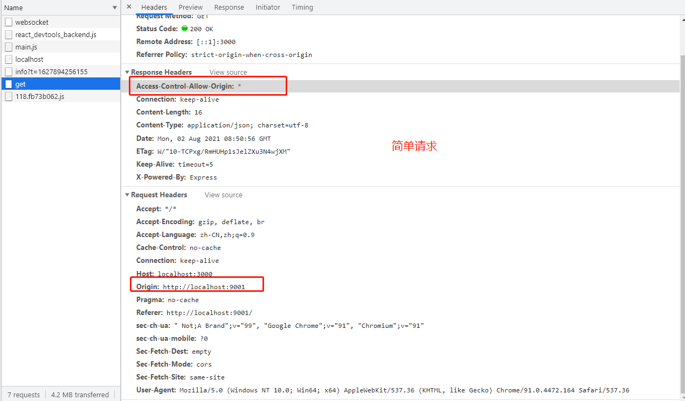
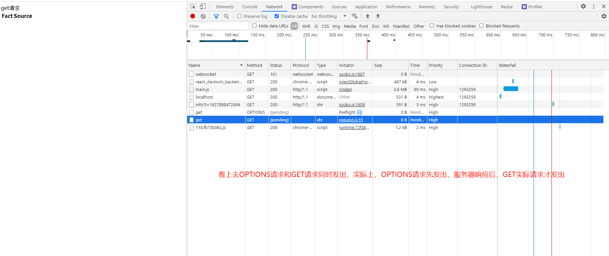
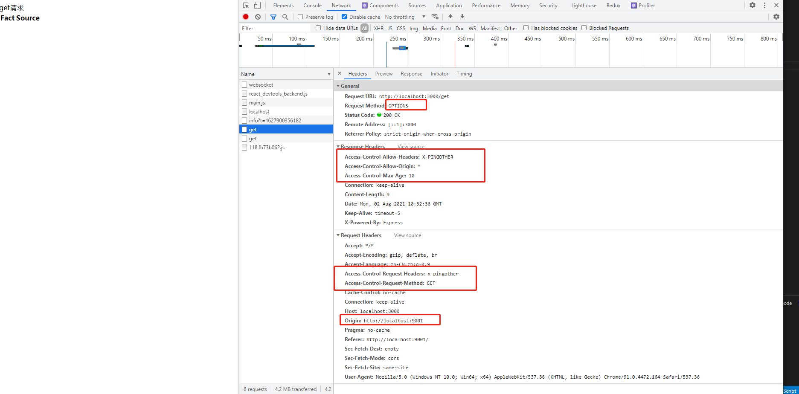

## 从前后端源码角度动手实践跨域原理

阅读本文不需要什么高端知识，动手实践才是最重要的

### 跨域简介

按 MDN 说法，[CORS](https://developer.mozilla.org/zh-CN/docs/Glossary/CORS)是一个系统，它由一系列传输的 HTTP 头组成，这些 HTTP 头决定浏览器是否阻止前端 JavaScript 代码获取跨域请求的响应。

浏览器的`同源安全策略`默认阻止“跨域”获取资源。但是 CORS 给了 web 服务器这样的权限，即服务器可以选择，允许跨域请求访问到它们的资源

一句话来说就是，不同域名，不同端口就一定是跨域的。记住，发生跨域的请求，实际上服务器是成功响应了浏览器的请求，只是由于服务器没有给请求响应头设置对应的跨域 HTTP 头字段，导致浏览器阻止 JavaScript 获取响应内容。

因此我们需要在服务端设置相应的响应头字段，目的就是告诉浏览器

- 服务器允许浏览器携带哪些请求头字段
- 允许浏览器使用哪些请求方法
- 允许浏览器通过 js 访问哪些响应头字段
- 是否允许浏览器携带 cookie 凭证，以实现跨域通信

### 与 CORS 有关的 HTTP 头字段

分为请求头和响应头字段。请求头又分为预检(OPTIONS)请求头和正式(即我们的请求)请求头。响应头也分为预检响应头和正式请求的响应头

#### 响应头字段

正式请求的响应头，即我们通过 xhr 发起的请求

- Access-Control-Allow-Origin。**必须**设置的。
  - 一般情况下可以设置为"\*"
  - 如果请求头携带了`cookie`或者`authorization`等`Credentials(凭证)`，则`Access-Control-Allow-Origin`必须设置了指定的域名
  - 如果指定了域名并且服务器的返回会根据`Origin`请求头的不同而不同，则必须在`Vary`响应头中包含`Origin`，否则浏览器会使用缓存。
- Access-Control-Allow-Credentials。值为 true。允许浏览器携带 cookie 等凭证信息
  - 跨域请求默认不发送 Cookie 和 HTTP 认证信息，如果要把 Cookie 发到服务器，一方面服务器要指定 Access-Control-Allow-Credentials 字段。另一方面，开发者必须在 AJAX 请求中打开 withCredentials 属性。
  - Credentials 可以是 cookies, authorization headers 或 TLS client certificates。
  - 当作为对预检请求的响应的一部分时，这能表示是否真正的请求可以使用 credentials。注意简单的 GET 请求没有预检，所以若一个对资源的请求带了 credentials，如果这个响应头没有随资源返回，响应就会被浏览器忽视，不会返回到 web 内容。这个响应头必须配合 XMLHttpRequest.withCredentials 使用。
  - **需要注意的是，如果要发送 Cookie，Access-Control-Allow-Origin 就不能设为星号，必须指定明确的、与请求网页一致的域名。同时，Cookie 依然遵循同源政策，只有用服务器域名设置的 Cookie 才会上传，其他域名的 Cookie 并不会上传，且（跨源）原网页代码中的 document.cookie 也无法读取服务器域名下的 Cookie。**

预检(OPTIONS)请求的响应头，即浏览器在非简单请求发起前，会自动发起一次预检请求，下面这些字段是服务端对预检请求的响应头携带的字段

- Access-Control-Allow-Headers。**可选**，允许浏览器正式请求可以携带的请求头字段
  - 默认允许正式请求携带一些简单的请求头字段，比如`Accept`、`Accept-Language`、`Content-Language`、`Content-Language`等，这些不需要在`Access-Control-Allow-Headers`中列出。
  - 如果请求头带有`Access-Control-Request-Headers`或者`Authorization`，则该响应字段必须
- Access-Control-Allow-Methods。**必须的**。允许浏览器正式请求使用的请求方法，比如 GET，POST 等。
- Access-Control-Expose-Headers。允许浏览器正式请求能够访问的响应头字段。
  - 默认情况下，客户端只能通过 js 获取到`Cache-Control`、`Content-Language`、`Content-Length`、`Content-Type`、`Cache-Control`、`Expires`、`Last-Modified`、`Pragma`这几个简单响应头字段，如果要额外获取其他字段，则需要在`Access-Control-Expose-Headers`中列出。
- Access-Control-Max-Age。告诉浏览器在多长时间内可以不用发起跨域请求。
  - 如果值为-1，则表示禁用缓存，则每次`正式请求`前都需要发起 OPTIONS 预检请求

#### 请求头字段

正式请求携带的请求头字段：

- Origin。请求头字段，指示获取资源的请求是从什么域发起的。
  - 所有的跨域请求一定会携带这个请求头字段
  - 除 GET 或 HEAD 请求外的同源请求也会携带这个请求头字段

预检请求携带的请求头字段：

- Access-Control-Request-Headers。告知服务器正式请求会使用那些 HTTP 头。
- Access-Control-Request-Method。告知服务器正式请求会使用哪一种 HTTP 请求方法。

### 简单请求和非简单请求

浏览器将 CORS 请求分成两类：`简单请求`（simple request）和`非简单请求`（not-so-simple request）。只要同时满足以下两大条件，就属于**简单请求**。

- 请求方法是以下三种方法之一：
  - HEAD
  - GET
  - POST
- HTTP 的头信息不超出以下几种字段：
  - Accept
  - Accept-Language
  - Content-Language
  - Last-Event-ID
  - Content-Type：只限于三个值 application/x-www-form-urlencoded、multipart/form-data、text/plain

**凡是不同时满足上面两个条件，就属于非简单请求。浏览器对这两种请求的处理，是不一样的。**

### 简单请求

浏览器直接发起跨域请求，浏览器自动在跨域请求头中增加 Origin 请求头字段。服务器处理如下：

- 如果 Origin 指定的源不在许可范围内，服务器会返回一个正常的 HTTP 回应，但是没有包含 CORS 相关的响应头字段，比如 Access-Control-Allow-Origin。那么浏览器会阻止 js 代码获取跨域请求的响应，并抛出错误
- 如果 Origin 指定的源在许可范围，服务器返回的响应会包含以下几个 CORS 相关的字段：
  - Access-Control-Allow-Origin 字段，必须包含
  - Access-Control-Allow-Credentials，可选的。默认情况下，Cookie 不包括在跨域请求之中。设为 true，即表示服务器明确许可，Cookie 可以包含在请求中，一起发给服务器。这个值也只能设为 true，如果服务器不要浏览器发送 Cookie，删除该字段即可。
  - Access-Control-Expose-Headers，可选的。跨域请求时，XMLHttpRequest 对象的 getResponseHeader()方法只能拿到 6 个基本字段：Cache-Control、Content-Language、Content-Type、Expires、Last-Modified、Pragma。如果想拿到其他字段，就必须在 Access-Control-Expose-Headers 里面指定。上面的例子指定，getResponseHeader('FooBar')可以返回 FooBar 字段的值。

### 非简单请求

浏览器发现跨域的请求是非简单请求时，会在正式通信前，增加一次**预检请求(OPTIONS)请求**。浏览器先询问服务器，当前网页所在的域名是否在服务器的许可名单之中，以及可以使用哪些 HTTP 动词和头信息字段。只有得到肯定答复，浏览器才会发出正式的 XMLHttpRequest 请求，否则就报错

```js
// 这会触发一个预检请求
var url = "http://localhost:3000/cors";
var xhr = new XMLHttpRequest();
xhr.open("PUT", url, true);
xhr.setRequestHeader("X-Custom-Header", "value");
xhr.send();
```

预检请求的请求头包含两个特殊字段:

- Access-Control-Request-Method。必须的，用来列出浏览器的 CORS 请求会用到哪些 HTTP 方法，上例是 PUT
- Access-Control-Request-Headers。可选的，字段是一个逗号分隔的字符串，指定浏览器 CORS 请求会额外发送的头信息字段，上例是 X-Custom-Header。这个字段只有使用 xhr.setRequestHeader 设置一些额外的请求头时，浏览器才会自动增加这个字段

服务器收到"预检"请求以后，检查了 Origin、Access-Control-Request-Method 和 Access-Control-Request-Headers 字段以后，确认允许跨源请求，就可以做出回应。

```bash
HTTP/1.1 200 OK
Date: Mon, 01 Dec 2008 01:15:39 GMT
Server: Apache/2.0.61 (Unix)
Access-Control-Allow-Origin: http://api.bob.com
Access-Control-Allow-Methods: GET, POST, PUT
Access-Control-Allow-Headers: X-Custom-Header
Content-Type: text/html; charset=utf-8
Content-Encoding: gzip
Content-Length: 0
Keep-Alive: timeout=2, max=100
Connection: Keep-Alive
Content-Type: text/plain
```

如果服务器否定了预检请求，会返回一个正常的 HTTP 响应，但是没有任何 CORS 相关的头信息。这时浏览器就会认定服务器不同意预检请求就会报错。

### 浏览器的正常请求和回应

一旦服务器通过了"预检"请求，以后每次浏览器正常的 CORS 请求，就都跟简单请求一样，**只携带一个 CORS 相关的字段：Origin 头信息字段**。服务器的回应，也**只会有一个 CORS 相关的字段：Access-Control-Allow-Origin 头信息字段**

### 以下场景解释跨域请求的工作原理

所有的示例场景，后端项目运行在 localhost:3000 端口，前端项目运行在 localhost:9001 端口

#### 场景 1 简单请求

简单请求不会触发预检请求，服务器需要响应 Access-Control-Allow-Origin 以允许跨域访问，
此时请求头只携带了一个 Origin，服务器响应头只包含 Access-Control-Allow-Origin 字段

```js
// 服务端代码
const express = require("express");
const app = express();
app.get("/get", (request, response) => {
  // response.setHeader('Access-Control-Allow-Origin', '*'); // 如果不返回这个响应头，则浏览器会发生CORS错误
  response.json({ method: "get" });
});
const PORT = 3000;

app.listen(PORT, () => {
  console.log(`Facts Events service listening at http://localhost:${PORT}`);
});
```

前端项目运行在 localhost:9001 端口，请求如下:

```js
let xhr = new XMLHttpRequest();
const url = "http://localhost:3000/get";
xhr.onload = () => {
  if (xhr.status === 200) {
    return console.log(xhr.response || xhr.responseText);
  }
  return console.error("请求失败");
};
xhr.onerror = () => {
  return console.error("出错了");
};
xhr.open("GET", url);
xhr.send("hello");
```



### 场景 2 非简单请求，添加自定义请求头

由于 xhr 设置了自定义头`X-PINGOTHER`，因此会自动触发预检请求

```js
let xhr = new XMLHttpRequest();
const url = "http://localhost:3000/get";
xhr.onload = () => {
  if (xhr.status === 200) {
    return console.log(xhr.response || xhr.responseText);
  }
  return console.error("请求失败");
};
xhr.onerror = () => {
  return console.error("出错了");
};
xhr.open("GET", url);
xhr.setRequestHeader("X-PINGOTHER", "pingpong");
xhr.send("hello");
```

如果此时 nodejs 如下，

```js
const express = require("express");

const app = express();
app.use((req, res, next) => {
  console.log("中间件没有调用next", req.method);
});
app.get("/get", (request, response) => {
  response.json({ method: "get" });
});
app.listen(3000, () => {
  console.log(`service listening at http://localhost:3000`);
});
```

中间件并没有调用 next，我们看下浏览器的 NetWork


服务端允许跨域访问：

```js
const express = require("express");

const app = express();
app.use((req, res, next) => {
  if (req.method === "OPTIONS") {
    // 预检请求需要设置的请求头
    res.setHeader("Access-Control-Allow-Origin", "*"); // 必须的
    res.setHeader("Access-Control-Allow-Headers", "X-PINGOTHER"); // 如果请求头带上了Access-Control-Request-Headers，则响应必须带上Access-Control-Allow-Headers
    res.setHeader("Access-Control-Max-Age", -1); // 非必须
    // res.setHeader('Access-Control-Allow-Methods', 'GET'); // 非必须
    res.end();
  } else {
    // 普通请求必须带上Access-Control-Allow-Origin，否则浏览器会报CORS错误，尝试着注释掉这一行试试
    res.setHeader("Access-Control-Allow-Origin", "*");
    next();
  }
});
app.get("/get", (request, response) => {
  response.json({ method: "get" });
});
app.listen(3000, () => {
  console.log(`service listening at http://localhost:3000`);
});
```

`Access-Control-Max-Age`可有可无，如果设置为-1，则每次请求前都需要使用 OPTIONS 预检请求。如果不设置，谷歌浏览器默认最长缓存 5 秒，超过 5 秒重新发起 OPTIONS 请求。可以在浏览器控制台查看 NetWork，并且记得取消
`Disable Cache`选项，观察每次请求前是否都会发起 OPTIONS 请求。

OPTIONS 请求：


实际的请求：


#### 场景 3 请求携带 cookie

注意：下面是一个简单的 GET 请求，浏览器不会发起预检请求！！！

```js
let xhr = new XMLHttpRequest();
const url = "http://localhost:3000/get";
xhr.onload = () => {
  if (xhr.status === 200) {
    return console.log(xhr.response || xhr.responseText);
  }
  return console.error("请求失败");
};
xhr.onerror = () => {
  return console.error("出错了");
};
xhr.open("GET", url);
xhr.withCredentials = true;
xhr.send("hello");
```

`xhr.withCredentials = true; `设置为 ture，则请求头会带上 cookie 字段，如果不设置或者设置为 false，则请求头不会带上 cookie 字段，可以打开或者关闭这个字段观察浏览器 NetWork。如果请求头带上了 cookie，则服务端响应头必须设置`Access-Control-Allow-Credentials`为 true，并且`Access-Control-Allow-Origin`不能为\*，否则浏览器会报 CORS 错误。

```js
const express = require("express");
const app = express();
app.use((req, res, next) => {
  if (req.method === "OPTIONS") {
    // 预检请求
    res.setHeader("Access-Control-Allow-Origin", "*");
    res.end();
  } else {
    // 普通请求
    res.setHeader("Access-Control-Allow-Origin", "http://localhost:9001");
    res.setHeader("Vary", "Origin"); // 如果服务器未使用“*”，而是指定了一个域，那么为了向客户端表明服务器的返回会根据Origin请求头而有所不同，必须在Vary响应头中包含Origin
    res.setHeader("Access-Control-Allow-Credentials", "true"); // 如果浏览器只是简单的设置xhr.withCredentials = true，则不会触发预检请求
    next();
  }
});
app.get("/get", (request, response) => {
  response.json({ method: "get" });
});
app.listen(3000, () => {
  console.log(`service listening at http://localhost:3000`);
});
```

### 场景 4 服务端设置自定义响应头

这种情况不会触发预检请求，即使服务端不设置`Access-Control-Expose-Headers`响应头，浏览器不会报 CORS 错误，浏览器也能获取到响应的内容，只是获取不到服务器响应头。浏览器会报错：`Refused to get unsafe header "X-My-Custom-Header"`

```js
let xhr = new XMLHttpRequest();
const url = "http://localhost:3000/get";
xhr.onload = () => {
  if (xhr.status === 200) {
    const myHeader = xhr.getResponseHeader("X-My-Custom-Header");
    console.log("myHeader...", myHeader);
    return console.log(xhr.response || xhr.responseText);
  }
  return console.error("请求失败");
};
xhr.onerror = () => {
  return console.error("出错了");
};
xhr.open("GET", url);
xhr.send("hello");
```

需要在服务端设置 expose header 响应头：

```js
const express = require("express");

const app = express();
app.use((req, res, next) => {
  if (req.method === "OPTIONS") {
    // 预检请求
    res.setHeader("Access-Control-Allow-Origin", "*");
    res.end();
  } else {
    // 普通请求
    res.setHeader("Access-Control-Allow-Origin", "*");
    // res.setHeader('Access-Control-Expose-Headers', 'X-My-Custom-Header');
    next();
  }
});
app.get("/get", (request, response) => {
  response.setHeader("X-My-Custom-Header", "test custom header");
  response.json({ method: "get" });
});
app.listen(3000, () => {
  console.log(`service listening at http://localhost:3000`);
});
```

参考资料

- MDN[https://developer.mozilla.org/en-US/docs/Web/HTTP/CORS]
- CORS 源码[https://github.com/expressjs/cors/blob/master/lib/index.js]
